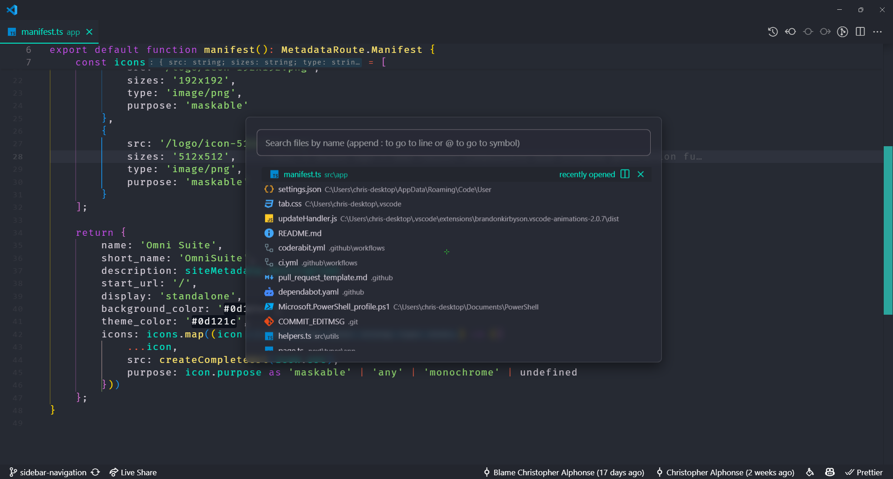
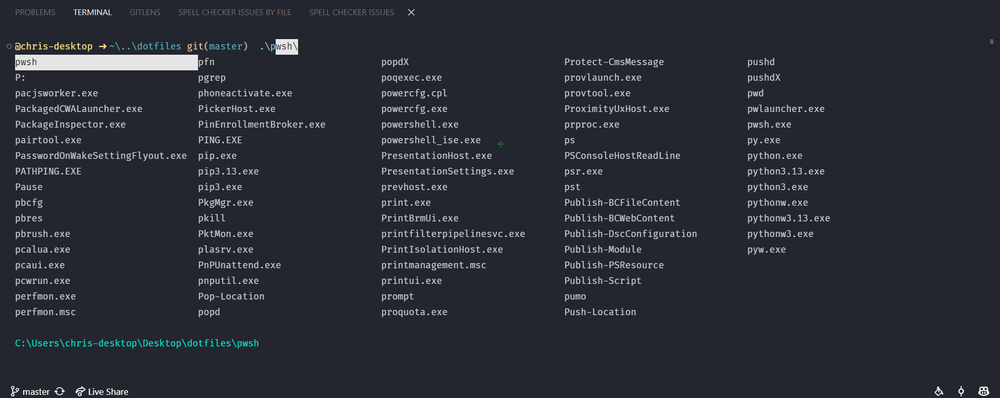
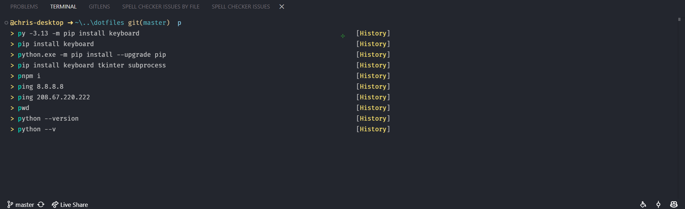
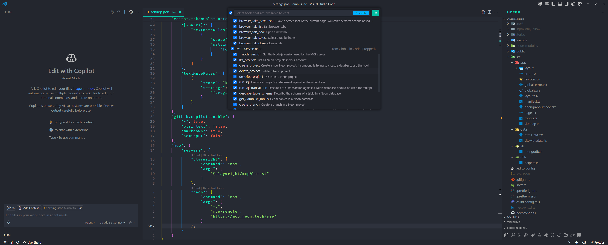
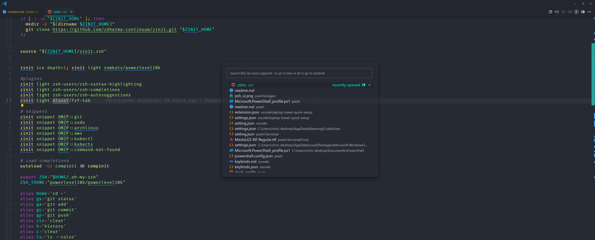

# Windows Development Environment Setup

[](LICENSE)
[](https://github.com/PowerShell/PowerShell)
[](https://code.visualstudio.com/)

A curated collection of dotfiles and scripts to automate the setup of a professional Windows development environment with PowerShell and VS Code optimizations.



## 🎯 Features

- One-click installation script
- Custom PowerShell prompt with Oh My Posh
- Performance-optimized terminal settings
- Enhanced VS Code configuration
- Fuzzy finder integration (FZF)
- Multiple package manager support
- Productivity-focused customizations

## Quick Setup

Open PowerShell and run:

```powershell
irm https://raw.githubusercontent.com/ChristopherAlphonse/dotfiles/refs/heads/master/bootstrap.ps1 | iex
```

## 📋 Prerequisites

- Windows 10/11
- [PowerShell Core 7.4+](https://apps.microsoft.com/detail/9MZ1SNWT0N5D)
- [Git for Windows](https://gitforwindows.org/)
- [VS Code 1.93+](https://code.visualstudio.com/)

## ⚙️ What Gets Installed

### Core Tools

- [Scoop](https://scoop.sh/) - Package manager
- [Winget](https://github.com/microsoft/winget-cli) - Windows package manager
- [Chocolatey](https://chocolatey.org/) - Package manager for Windows

### Terminal Utilities

- [Bat](https://github.com/sharkdp/bat) - Modern cat replacement
- [Ripgrep](https://github.com/BurntSushi/ripgrep) - Fast search tool
- [Fzf](https://github.com/junegunn/fzf) - Fuzzy finder
- [Terminal-Icons](https://github.com/devblackops/Terminal-Icons)
- [PSReadLine](https://docs.microsoft.com/en-us/powershell/module/psreadline/)
- [z Directory Jumper](https://www.powershellgallery.com/packages/z)

## 🎨 Terminal Configuration

### PowerShell Customization

- Theme Engine: [Oh My Posh](https://ohmyposh.dev/)
- Tab Completion: [Carapace](https://carapace.sh)
- Fuzzy Search: [PSFzf](https://github.com/kelleyma49/PSFzf)

### Carapace Completion



### Visual Settings

```json
{
    "colorScheme": "Dark+",
    "fontFace": "MesloLGLDZ Nerd Font",
    "fontSize": 16,
    "opacity": 23,
    "padding": 15,
    "useAcrylic": true
}
```

### Terminal History



## 🎮 VS Code Setup

### Must-Have Extensions

- [Custom CSS and JS Loader](https://marketplace.visualstudio.com/items?itemName=be5invis.vscode-custom-css)
- [VSCode Animations](https://marketplace.visualstudio.com/items?itemName=BrandonKirbyson.vscode-animations)
- [Apc Customize UI++](https://marketplace.visualstudio.com/items?itemName=drcika.apc-extension)
- [Azalais Dark Theme](https://marketplace.visualstudio.com/items?itemName=ChristopherAlphonse.azalais-dark-theme)

### Productivity Features

## 🆕 Latest Updates

### April 11, 2025

- Added MCP servers support
- Implemented agent mode testing
- Enhanced UI customizations



## Work Mode

For a cleaner, distraction-free experience:



## ⚠️ Important Note

These configurations are provided as-is. Review and understand all settings before applying them to your system. While these configurations support both macOS and Linux, they are primarily optimized for Windows with PowerShell Core and VS Code.

## 🤝 Contributing

Contributions are welcome! Please feel free to submit a Pull Request.
