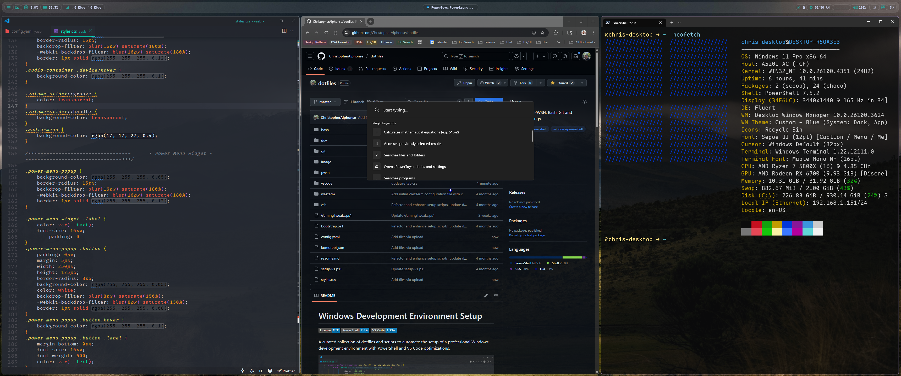
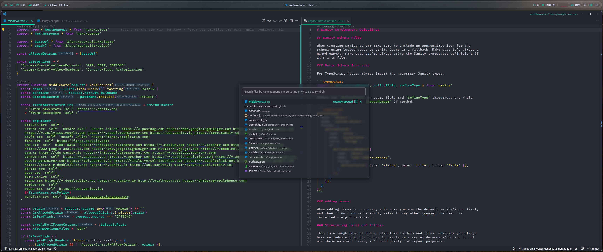
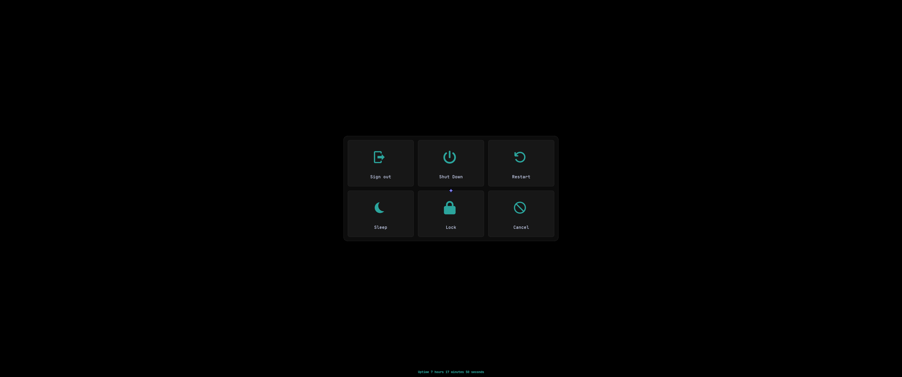

# Windows Development Environment Setup

[](LICENSE)
[](https://github.com/PowerShell/PowerShell)
[](https://code.visualstudio.com/)

A comprehensive Windows development environment setup featuring tiling window management, enhanced terminal experience, and productivity-focused customizations. This dotfiles collection transforms Windows into a powerful development workstation with Linux-like efficiency.



##  Overview

This setup provides a complete development environment that includes:

- **Tiling Window Manager**: Komorebi for efficient window management
- **Enhanced Terminal**: PowerShell with Oh My Posh, fuzzy search, and productivity tools
- **Status Bar**: YASB for system monitoring and quick access
- **Hotkey Daemon**: WHKD for global keyboard shortcuts
- **System Info**: Fastfetch for beautiful system information display
- **Gaming Optimizations**: Performance tweaks for competitive gaming

### VS CODE


### Tiling | Komorebi


###  Fluent search | Yasb | Surcrose wallpaper


### Terminal | PWSH 


### Terminal | WSL | ZSH


## Quick Setup

### One-Command Installation

```powershell
irm https://raw.githubusercontent.com/ChristopherAlphonse/dotfiles/refs/heads/master/bootstrap.ps1 | iex
```

### Manual Installation

1. **Clone the repository**:
   ```powershell
   git clone https://github.com/ChristopherAlphonse/dotfiles.git
   cd dotfiles
   ```

2. **Run the setup script**:
   ```powershell
   .\setup-v1.ps1
   ```

3. **Install additional tools**:
   ```powershell
   winget install LGUG2Z.komorebi
   winget install fastfetch
   winget install LGUG2Z.whkd
   winget install --id AmN.yasb
   ```

### Advanced Installation Options

The setup script supports various command-line parameters for customization:

#### Minimal Installation
Install only essential tools (Git, VS Code, Windows Terminal):
```powershell
.\setup-v1.ps1 -MinimalInstall
```

#### Silent/Unattended Installation
Run without user prompts (auto-accepts defaults):
```powershell
.\setup-v1.ps1 -Silent
```

#### Skip Specific Packages
Exclude packages by ID (comma-separated):
```powershell
.\setup-v1.ps1 -SkipPackages "Docker.DockerDesktop,Microsoft.AzureCLI"
```

#### Skip Optional Components
Skip VS Code extensions or dotfiles setup:
```powershell
.\setup-v1.ps1 -SkipVSCodeExtensions
.\setup-v1.ps1 -SkipDotfiles
```

#### Skip Pre-flight Checks
Bypass system validation (not recommended):
```powershell
.\setup-v1.ps1 -SkipPreFlightChecks
```

#### Custom Configuration File
Use a custom config file for full control:
```powershell
# Copy and customize the example
Copy-Item config-example.json config.json
# Edit config.json with your preferences
.\setup-v1.ps1 -ConfigFile .\config.json
```

#### Combined Parameters
Mix and match parameters for flexibility:
```powershell
# Silent minimal install without Docker
.\setup-v1.ps1 -Silent -MinimalInstall -SkipPackages "Docker.DockerDesktop"
```

##  Prerequisites

- Windows 10/11 (Build 19041+)
- [PowerShell Core 7.4+](https://apps.microsoft.com/detail/9MZ1SNWT0N5D)
- Administrator privileges for system modifications
- Internet connection for package downloads

##  What Gets Installed

### Core Development Tools

- **Git** - Version control system
- **VS Code** - Code editor with custom configuration
- **Windows Terminal** - Enhanced terminal with custom settings
- **Python 3.11** - Programming language
- **Docker Desktop** - Containerization platform
- **Node.js & NPM** - JavaScript runtime and package manager

### Productivity Tools

- **PowerToys** - Windows utilities for power users
- **Slack** - Team communication
- **Oh My Posh** - PowerShell prompt customization
- **Chocolatey** - Package manager for Windows

### Terminal Utilities

- **Bat** - Modern cat replacement with syntax highlighting
- **Ripgrep** - Fast search tool
- **Fzf** - Fuzzy finder for command line
- **Terminal-Icons** - File and folder icons in terminal
- **PSReadLine** - Enhanced PowerShell command line editing
- **z Directory Jumper** - Smart directory navigation

## Terminal Configuration

### PowerShell Customization


_ps: use the `help`  command in the terminal for full pwsh commands_


The PowerShell profile provides a rich development experience with:
- **Auto-updating profile** - Automatically syncs with the latest version
- **Fuzzy file search** - `ff` command for finding files with preview
- **System utilities** - `uptime`, `admin`, `winutil` commands
- **Git shortcuts** - Enhanced git workflow with aliases
- **File management** - `trash`, `mkcd`, `nf` commands

 


### Carapace Completion

Intelligent tab completion that learns from your usage patterns:


### Visual Settings

- **Font**: MesloLGLDZ Nerd Font
- **Theme**: Dark+ with custom colors
- **Transparency**: 23% opacity with acrylic effect
- **Padding**: 15px for comfortable reading

### Command History

Enhanced history with fuzzy search and preview:


## Window Management (Komorebi)

### Features

- **Tiling Layouts**: BSP, Vertical/Horizontal Stack, Grid, Monocle
- **Workspace Management**: 7 pre-configured workspaces per monitor
- **Window Borders**: Customizable borders with focus indicators
- **Animations**: Smooth window transitions (400ms duration, 120fps)
- **Multi-Monitor Support**: Seamless workspace switching across displays

### Key Bindings

- `Alt + HJKL` - Focus windows
- `Alt + Shift + HJKL` - Move windows
- `Alt + 1-7` - Switch workspaces
- `Alt + Shift + 1-7` - Move window to workspace
- `Alt + T` - Toggle float
- `Alt + F` - Toggle monocle
- `Alt + R` - Retile workspace

### Configuration

The Komorebi setup includes:
- **7 workspace layouts** optimized for different tasks
- **Custom borders** with focus indicators
- **Smooth animations** for window transitions
- **Multi-monitor support** with workspace isolation

##  Gaming Optimizations

The `GamingTweaks.ps1` script applies competitive-level system optimizations:

### Performance Enhancements

- **Ultimate Performance Power Plan** - Maximum CPU/GPU performance
- **Memory Management** - Optimized paging and caching
- **Network Optimization** - Disabled Nagle's algorithm for low latency
- **Input Queue Sizes** - Increased mouse/keyboard buffer sizes
- **Hardware-Accelerated GPU Scheduling** - Reduced rendering latency

### System Optimizations

- **Disabled Services** - SysMain, WSearch, DiagTrack, RetailDemo
- **Visual Effects** - Optimized for performance over aesthetics
- **Startup Programs** - Removed non-essential startup items
- **Fullscreen Optimizations** - Disabled for better gaming performance
- **Game Bar** - Removed Xbox Game Bar for cleaner experience

### DPC Latency Fixes

- **NDU Service** - Disabled to reduce DPC latency
- **HPET** - Disabled via BCD for better timing precision

## VS Code Setup

### Custom Configuration

- **Activity Bar**: Moved to top for better space utilization
- **Side Bar**: Positioned on the right
- **Editor**: FiraCode Nerd Font with ligatures disabled
- **Transparency**: Custom CSS for window transparency
- **Animations**: Smooth transitions and effects



### Must-Have Extensions

- **Custom CSS and JS Loader** - For custom styling
- **VSCode Animations** - Smooth interface animations
- **Apc Customize UI++** - Advanced UI customization
- **Azalais Dark Theme** - Custom dark theme
- **GitHub Copilot** - AI code completion

### Key Bindings

- `Ctrl + [` / `Ctrl + ]` - Navigate between panels
- `Ctrl + \` - Split terminal
- `Ctrl + D` - Add selection to next find match
- `Ctrl + Up/Down` - Move cursor by lines
- `Ctrl + N` - New file in explorer
- `Ctrl + F` - New folder in explorer
- `Ctrl + Shift + F5` - Run active file

##  Status Bar (YASB)

YASB provides a customizable status bar with:

- **System Information** - CPU, memory, disk usage
- **Network Status** - Connection speed and status
- **Time and Date** - Current time with custom formatting
- **Weather** - Current weather conditions
- **Custom Widgets** - Extensible widget system

##  Development Scripts

### Setup Scripts

- **`setup-v1.ps1`** - Main development environment setup
- **`bootstrap.ps1`** - One-command installer
- **`GamingTweaks.ps1`** - Gaming performance optimizations
- **`dev/nerdFont.ps1`** - Nerd Font installation
- **`dev/npm.ps1`** - Node.js and NPM setup

### Git Configuration

Enhanced Git workflow with:
- **Custom aliases** - Short commands for common operations
- **Editor integration** - VS Code as default editor
- **Credential management** - Windows credential manager
- **Safe directories** - Configured for development paths

## Workflow Integration

### Development Workflow

1. **Start Komorebi**: `komorebic start --whkd --bar`
2. **Open Terminal**: Enhanced PowerShell with productivity tools
3. **Navigate**: Use `z` for smart directory jumping
4. **Search**: Use `ff` for fuzzy file finding
5. **Code**: VS Code with custom theme and extensions
6. **Monitor**: YASB status bar for system information

### Productivity Features

- **Auto-updating profile** - Always latest PowerShell configuration
- **Fuzzy search** - Find files and commands quickly
- **Window management** - Efficient workspace organization
- **System monitoring** - Real-time system information
- **Gaming optimizations** - Performance when needed

##  Latest Updates

### April 2025

- **Komorebi Integration** - Tiling window manager for Windows
- **YASB Status Bar** - Customizable system monitoring
- **WHKD Hotkeys** - Global keyboard shortcuts
- **Fastfetch** - Beautiful system information display
- **Enhanced Gaming Tweaks** - Competitive-level optimizations

##  Gaming Mode

For competitive gaming, the setup includes:

- **Performance optimizations** - Maximum system performance
- **Low latency network** - Optimized for online gaming
- **Input optimization** - Reduced input lag
- **Visual optimizations** - Performance over aesthetics


# Signing off


## ⚠️ Important Notes

- **Administrator Rights**: Required for system modifications
- **Backup**: Registry backup created before gaming tweaks
- **Restart Required**: Some changes require system restart
- **Compatibility**: Tested on Windows 10/11
- **Customization**: All configurations are modular and customizable

##  Contributing

Contributions are welcome! Please feel free to submit a Pull Request.

##  License

This project is licensed under the MIT License - see the [LICENSE](LICENSE) file for details.

---

**Note**: These configurations are optimized for Windows with PowerShell Core and VS Code. While some components may work on other platforms, they are primarily designed for Windows development workflows.


