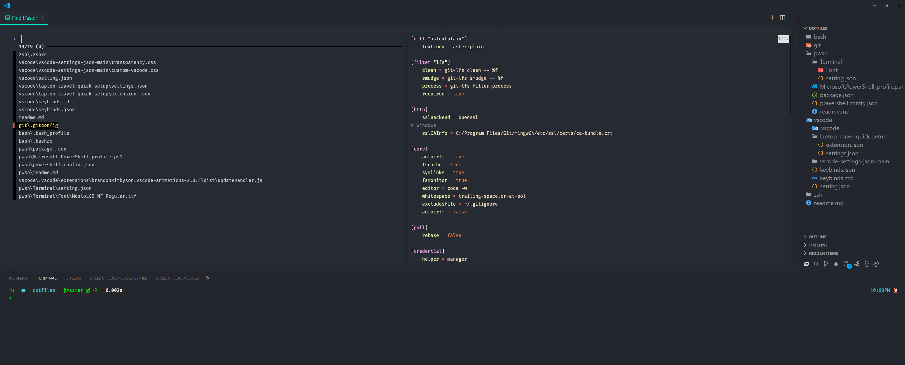
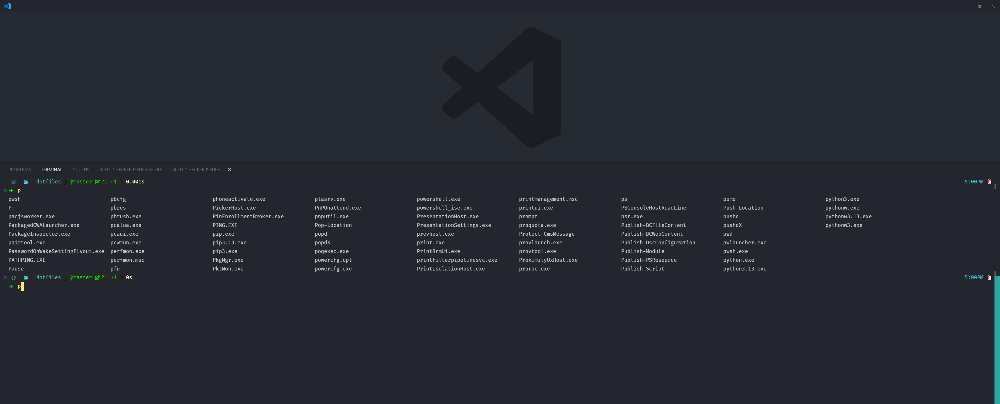
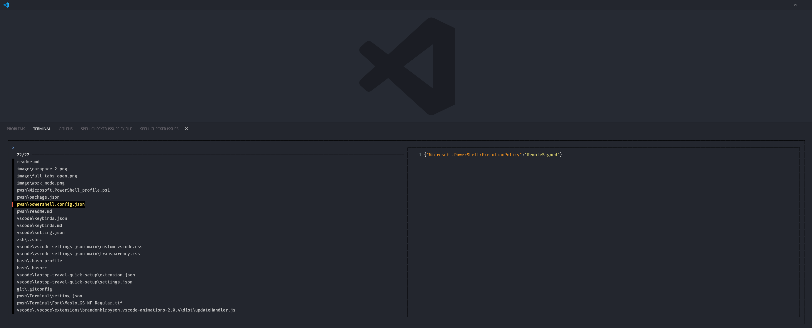

# Full Configuration Overview

## Full Setup with All Features Enabled



## Minimalistic Work Mode


> **Warning**: Do not blindly apply these settings unless you fully understand their implications. Use them at your own risk! While these configurations support both macOS and Linux, the primary focus is on **VS Code** and **PowerShell (PWSH)**.

---

## Requirements

-   [PowerShell](https://apps.microsoft.com/detail/9MZ1SNWT0N5D?hl=en-us&gl=US&ocid=pdpshare)
-   [Bat](https://github.com/sharkdp/bat)
-   [Ripgrep](https://github.com/BurntSushi/ripgrep)
-   [Fzf](https://github.com/junegunn/fzf)
-   [Vscode v1.93](https://code.visualstudio.com/updates/v1_93)

---

## PowerShell Setup (Windows)

To get started with PowerShell customization, install the following tools:

-   [Scoop](https://scoop.sh/) - A command-line package manager
-   [Git for Windows](https://gitforwindows.org/)
-   [Oh My Posh](https://ohmyposh.dev/) - A powerful prompt theme engine
-   [Terminal Icons](https://github.com/devblackops/Terminal-Icons) - Adds file and folder icons
-   [PSReadLine](https://docs.microsoft.com/en-us/powershell/module/psreadline/) - Enhances command-line editing and autocompletion
-   [z](https://www.powershellgallery.com/packages/z) - A directory jumper for quick navigation
-   [PSFzf](https://github.com/kelleyma49/PSFzf) - Fuzzy finder integration
-   [PowerShellGet](https://www.powershellgallery.com/packages/PowerShellGet/2.2.5) - Manages PowerShell modules and scripts

To enable **sudo** (for running admin commands without launching PowerShell as an administrator), install:

```sh
scoop install curl sudo jq
```

---

## PowerShell Terminal Configuration

### Carapace - Tab Autocompletion & Aliases



### Terminal Appearance

-   **Color scheme**: `"Dark+"`
-   **Cursor shape**: `"filledBox"`
-   **Experimental retro terminal effect**: `false`
-   **Font**: `"MesloLGLDZ Nerd Font"`
-   **Font size**: `16`
-   **History size**: `200`
-   **Intense text style**: `"none"`
-   **Opacity**: `23`
-   **Padding**: `15`
-   **Source**: `"Windows.Terminal.PowershellCore"`
-   **Use acrylic**: `true`
-   **Guid**: `"{574e775e-4f2a-5b96-ac1e-a2962a402336}"`
-   **Hidden**: `false`

#### PowerShell -> Appearance Settings

-   **Transparency**:
    -   **Background opacity**: 51%
    -   **Enable acrylic material**: **ON**

---

#### PowerShell -> Appearance Settings

-   **Transparency**
    -   Background opacity: 51%
    -   Enable acrylic material: **ON**

---

## Invoke fuzzy search with command _ff_



## Visual Studio Code Enhancements

### Extensions

-   [Custom CSS and JS Loader](https://marketplace.visualstudio.com/items?itemName=be5invis.vscode-custom-css) - Enables custom UI modifications
-   [VSCode Animations](https://marketplace.visualstudio.com/items?itemName=BrandonKirbyson.vscode-animations) - Adds smooth UI animations
-   [Apc Customize UI++](https://marketplace.visualstudio.com/items?itemName=drcika.apc-extension) - Fine-tune Electron settings
-   [Azalais Dark](https://marketplace.visualstudio.com/items?itemName=ChristopherAlphonse.azalais-dark-theme) - My preferred theme

---
