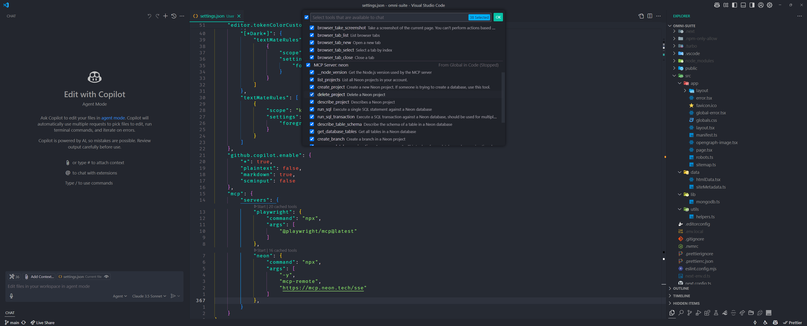

## 🆕 Latest Updates

### April 22, 2025

- Added new functions to move files and copy
- Switching to [Wezterm emulator](https://wezterm.org/)
- Find config at [here](./wezterm/.wezterm.lua)

### April 11, 2025

- Added MCP servers support
- Implemented agent mode testing
- Enhanced UI customizations

